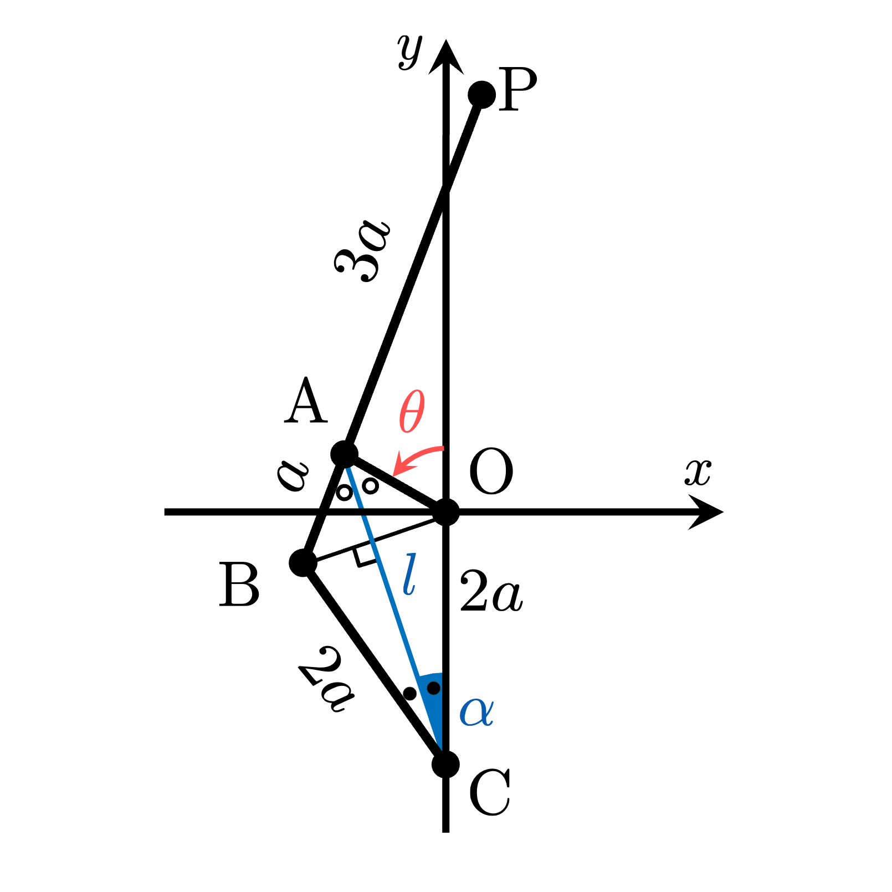

# Water Drop Linkage
"water-drop-linkage" is a simulator of a linkage mechanism  with gnuplot.
To create this simulator, I referenced the following tweet.

**<blockquote class="twitter-tweet"><p lang="und" dir="ltr"><a href="https://t.co/wW6MiVxrWs">pic.twitter.com/wW6MiVxrWs</a></p>&mdash; 上木 敬士郎 Keishiro Ueki (@ChocoLinkage) <a href="https://twitter.com/ChocoLinkage/status/1399198044122271746?ref_src=twsrc%5Etfw">May 31, 2021</a></blockquote> <script async src="https://platform.twitter.com/widgets.js" charset="utf-8"></script>**

# Demo


# Modeling


## Coordinate of  and 


## Length  and angle 
 ,


## Coordinate of  and 


# Features
You enable to switch terminal type `qt` or `pngcairo` by using **`qtMode`**.
- If you select `qt` terminal (`qtMode==1`), gnuplot opens qt window and you can run this simulator.

- On the other hand, in `pngcairo` terminal (`qtMode!=1`), you can get a lot of PNG images of the simulation.
By using the outputted images, you can make a video or an animated GIF.

# Operating environment
<!-- # Requirement -->
- macOS Big Sur 11.3.1 / Macbook Air (M1, 2020) 16GB
- gnuplot version 5.4 patchlevel 1
- VScode 1.56.2

<!-- # Installation -->
 
# Usage
```
git clone https://github.com/hiroloquy/water-drop-linkage.git
cd water-drop-linkage
gnuplot
load 'water_drop_linkage.plt'
```

# Note
I made a MP4 file (demo.mp4) by using **ffmpeg**.

```
cd water-drop-linkage
ffmpeg -framerate 60 -i png/img_%04d.png -vcodec libx264 -pix_fmt yuv420p -vf "scale=trunc(iw/2)*2:trunc(ih/2)*2" -r 60 demo.mp4
```
 
# Author
* Hiro Shigeyoshi
* Twitter: https://twitter.com/Sm_pgmf
 
# License
"water-drop-linkage" is under [Hiroloquy](https://hiroloquy.com/).
 